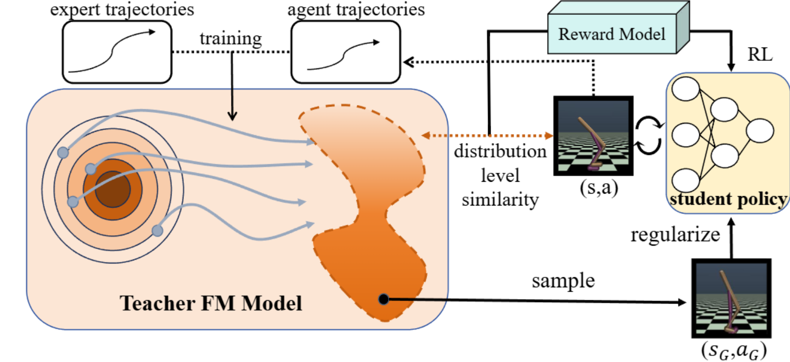

# FM-IRL: Flow-Matching for Reward Modeling and Policy Regularization in Reinforcement Learning

<h1 align="center"> 
    
</h1>

The Official implementation of [**FM-IRL: Flow-Matching for Reward Modeling and Policy Regularization in Reinforcement Learning**](https://arxiv.org/abs/2510.09222).

*Zhenglin Wan\*<sup>1</sup>,
Jingxuan Wu\*<sup>2</sup>,
Xingrui Yu<sup>3</sup>,
Chubin Zhang<sup>4</sup>,
Mingcong Lei<sup>5</sup>,
Bo An<sup>1</sup>, Ivor Tsang<sup>3</sup><br>*

<sup>1</sup>College of Computing and Data Science, NTU, Singapore
<sup>2</sup>Department of Statistics and Operations Research, UNC-Chapel Hill, America  <sup>3</sup>Centre for Frontier AI Research, A*STAR, Singapore  <sup>4</sup>School of Computer Science, BUPT, China <sup>5</sup>School of Data Science, CUHK(SZ), China

(\*Equal contribution)


This work proposes a novel framework that addresses the limitations of Flow Matching (FM) in online settings by introducing a student-teacher architecture. While FM excels at offline behavioral cloning, it struggles with exploration and online optimization due to gradient instability and high inference costs. Our approach employs a simple MLP-based student policy for efficient environment interaction and online RL updates, guided by a reward model derived from a teacher FM policy that encapsulates expert distribution knowledge. The teacher FM simultaneously regularizes the student's behavior to stabilize learning. This combination maintains the expressiveness of FM while enabling stable gradient computation and efficient exploration, significantly improving generalization and robustness, particularly with suboptimal expert data. The detailed workflow:

## Environment Setup and Installation Guide

### Fork or Clone
[Recommended] Fork this repository to your github account and run below command in your terminal: 
```   
git clone [the address of forked repository]
cd FM_IRL
```

or directly clone this repository to local:

```   
git clone https://github.com/vanzll/FM_IRL
cd FM_IRL
```

### Software Environment Configuration

This codebase requires `Python 3.8` or higher. All required packages are listed in the `requirements.txt` file. To set up the environment from scratch using conda, execute the following commands:
   ```   
   conda create -n fmirl python=3.8
   conda activate fmirl
   ./utils/setup.sh
   ```

Please be noted that we use CUDA 11.7 to conduct our experiment, and you may need to run ```nvidia-smi``` to check if the CUDA version on the upper-right corner is greater than OR equal to 11.7, and install CUDA on your PC.
### Weights & Biases Setup

Configure [Weights and Biases](https://wandb.ai/site) by first logging in with `wandb login <YOUR_API_KEY>` and then editing `config.yaml` with your W&B username and project name.

## Expert Demonstration Setup

Expert demonstration data is stored in the *expert_datasets* folder. We use Git LFS to store the expert demonstration files.

## Experiment Reproduction Guide

To reproduce the experiments conducted in our paper, follow these steps:

### 1. Select Configuration Files
The wandb sweep configuration files for all tasks can be found in the `configs` directory. Each subdirectory (e.g., `./configs/ant`) contains at least seven common files:
- `airl.yaml`
- `diffusion_policy.yaml`
- `drail.yaml`
- `fm_policy.yaml`
- `fmirl.yaml`
- `gail.yaml`
- `wail.yaml`

### 2. Run Experiments
After selecting the desired configuration file, execute the following command:
   ```
   ./utils/wandb.sh <Configuration_file_path.yaml>
   ```
- Example: ```./utils/wandb.sh ./configs/ant/fmirl.yaml```


The results will be stored in ./data/log with the format [env_name]_[algo_name]/seed/metrics.csv


## Code Structure Overview

### Core Components
- `fmirl`: Implementation of our main method
- `utils`: Utility scripts
  - `utils/wandb.sh`: Script to automatically create and execute wandb commands from configuration files
  - `utils/setup.sh`: Script to install and set up the conda environment
- `shape_env`: Custom environment code for reference
- `goal_prox`: Customized environment code from [goal_prox_il](https://github.com/clvrai/goal_prox_il)
  - `goal_prox/envs/ant.py`: AntGoal locomotion task
  - `goal_prox/envs/fetch/custom_fetch.py`: FetchPick task
  - `goal_prox/envs/hand/manipulate.py`: HandRotate task
- `rl-toolkit`: Base RL code and imitation learning baselines from [rl-toolkit](https://github.com/ASzot/rl-toolkit)
  - `rl-toolkit/rlf/algos/on_policy/ppo.py`: PPO policy updater code for RL
  - `rl-toolkit/rlf/algos/il/gail.py`: Baseline Generative Adversarial Imitation Learning (GAIL) code
  - `rl-toolkit/rlf/algos/il/wail.py`: Baseline Wasserstein Adversarial Imitation Learning (WAIL) code
  - `rl-toolkit/rlf/algos/il/dp.py`: Baseline Diffusion Policy code
- `d4rl`: Codebase from [D4RL: Datasets for Deep Data-Driven Reinforcement Learning](https://github.com/rail-berkeley/d4rl) for Maze2D

## Acknowledgements

### Code Sources
- Base code adapted from [goal_prox_il](https://github.com/clvrai/goal_prox_il) and [DRAIL](https://www.bing.com/search?q=DRAIL&qs=n&form=QBRE&sp=-1&ghc=1&lq=0&pq=dra&sc=12-3&sk=&cvid=5963FB49AC6B4B4695432D9D97013E75)
- Fetch-pick and Hand-rotate environments customized based on [OpenAI](https://github.com/openai/robogym) implementations
- Ant environment customized by [goal_prox_il](https://github.com/clvrai/goal_prox_il) and originated from [Farama-Foundation](https://github.com/Farama-Foundation/Gymnasium)
- Maze2D environment based on [D4RL: Datasets for Deep Data-Driven Reinforcement Learning](https://github.com/rail-berkeley/d4rl)

## Results
<h1 align="center"> 
    
</h1>

|  | Navigation (Avg Suc. Rate) |  | Manipulation (Avg Suc. Rate) |  | Locomotion (Avg Return) |  |
|---|---|---|---|---|---|---|
| Algorithm | (a) Ant-goal | (e) Maze2d | (b) Hand-rotate | (c) Fetch-pick | (d) Hopper | (f) Walker2d |
| DRAIL | 0.7142 (±0.0160) | 0.7780 (±0.0373) | 0.7775 (±0.2847) | 0.7052 (±0.3538) | 3182.60 (±85.25) | 3122.69 (±764.43) |
| GAIL | 0.6465 (±0.0542) | 0.6902 (±0.0826) | 0.9317 (±0.0541) | 0.2798 (±0.3316) | 2921.73 (±243.64) | 1698.25 (±411.42) |
| WAIL | 0.6127 (±0.0153) | 0.2978 (±0.0785) | 0.2370 (±0.3830) | 0.0000 (±0.0000) | 2609.28 (±814.05) | 1729.20 (±984.86) |
| VAIL | 0.7662 (±0.0365) | 0.6360 (±0.0382) | 0.5694 (±0.2960) | 0.8539 (±0.0551) | 2878.04 (±286.72) | 1156.52 (±221.67) |
| AIRL | 0.5467 (±0.0246) | 0.8239 (±0.0241) | 0.4595 (±0.1993) | 0.0000 (±0.0000) | 7.86 (±2.91) | -5.27 (±1.18) |
| DP | 0.8212 (±0.0135) | 0.5618 (±0.0268) | 0.9068 (±0.0136) | 0.8298 (±0.0127) | 1433.21 (±131.03) | 2204.41 (±226.28) |
| FP | **0.8334** (±0.0222) | 0.5420 (±0.0207) | 0.9032 (±0.0188) | 0.5460 (±0.0367) | 1950.41 (±170.32) | 2384.81 (±187.98) |
| FM-IRL (Ours) | 0.8225 (±0.0284) | **0.8731** (±0.0331) | **0.9794** (±0.0150) | **0.9984** (±0.0023) | **3358.95** (±72.31) | **4164.24** (±62.19) |
## Citation

If you find this work useful, please consider to give a star and cite our paper:

```bibtex
@misc{wan2025fmirlflowmatchingrewardmodeling,
      title={FM-IRL: Flow-Matching for Reward Modeling and Policy Regularization in Reinforcement Learning}, 
      author={Zhenglin Wan and Jingxuan Wu and Xingrui Yu and Chubin Zhang and Mingcong Lei and Bo An and Ivor Tsang},
      year={2025},
      eprint={2510.09222},
      archivePrefix={arXiv},
      primaryClass={cs.LG},
      url={https://arxiv.org/abs/2510.09222}, 
}
```
